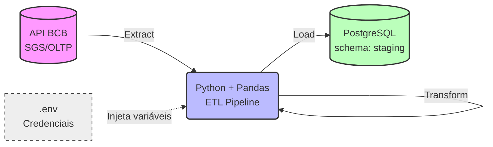

# 🇧🇷 Análise do Brasil — Pipeline de Dados Macroeconômicos


Pipeline ETL desenvolvido em Python que extrai indicadores macroeconômicos (SELIC e IPCA) da API do Banco Central do Brasil (SGS), transforma em série mensal consolidada e carrega em um banco de dados PostgreSQL. O projeto serve como fundação de dados confiável para futuras análises, dashboards e modelos preditivos.

---

## 🛠️ Tech Stack
*   **Linguagem:** Python 3.12+
*   **Manipulação de Dados:** Pandas
*   **Banco de Dados:** PostgreSQL
*   **Integração e ORM:** SQLAlchemy, psycopg2
*   **Gestão de Configurações:** python-dotenv

## 🎯 Objetivo

Construir uma fundação de dados confiável sobre a economia brasileira, começando com uma arquitetura simples (ETL local focado em 2 séries) e evoluindo iterativamente para uma plataforma completa com orquestração em nuvem, modelos preditivos e consumo via API de IA Generativa.

## 🏗️ Arquitetura



### Estrutura de Pastas

```text
Analise-Brasil/
├── .env                     # Credenciais (NÃO versionar — ver .gitignore)
├── .gitignore
├── requirements.txt
├── README.md
└── src/
    ├── main.py              # Ponto de entrada (Entrypoint) do pipeline
    ├── adapters/
    │   └── bcb_api.py       # Cliente da API do BCB (com retry e timeout)
    └── pipelines/
        └── etl_macro.py     # Lógica central: extract → transform → load
```

### Fontes de Dados

| Indicador | Série SGS | Periodicidade | Coluna no Banco |
|-----------|-----------|---------------|-----------------|
| **SELIC** | 432       | Diária        | `taxa_selic`    |
| **IPCA**  | 433       | Mensal        | `ipca_pct`      |

> 💡 **Nota sobre a SELIC**: A série 432 é diária. A função `transform()` utiliza `resample("MS").last()` para consolidar sempre o último valor vigente do mês, alinhando a granularidade com o IPCA. *(Alternativa futura: migrar para a série 4390, eliminando a necessidade de resample).*

## 🚀 Como Rodar Localmente

### Pré-requisitos
*   Python 3.12 ou superior
*   PostgreSQL rodando localmente (com um banco chamado `macro` criado)

### Passo a Passo

1. **Clone o repositório e acesse a pasta:**
   ```bash
   git clone https://github.com/YuriFerreira11/Analise-Brasil.git
   cd Analise-Brasil
   ```

2. **Crie e ative o ambiente virtual:**
   ```bash
   python -m venv .venv
   # Windows:
   .venv\Scripts\activate        
   # Linux/Mac:
   source .venv/bin/activate   
   ```

3. **Instale as dependências:**
   ```bash
   pip install -r requirements.txt
   ```

4. **Configure as credenciais:**
   Crie um arquivo `.env` na raiz do projeto com as suas configurações locais:
   ```env
   DATABASE_URL=link
   ```

5. **Execute o pipeline:**
   ```bash
   python src/main.py
   ```

**Saída esperada no terminal:**
```text
✓ ano 2020 extraído
...
✓ ano 2026 extraído
Sucesso: 80 linhas carregadas em staging.indicadores_macro
```

## ⚙️ Decisões Técnicas (e os "porquês")

| Decisão Arquitetural | Motivação |
|---|---|
| **Paginação por ano no *Extract*** | A API pública do BCB possui instabilidades; requisições muito longas estouravam o timeout. |
| **Validação explícita no *Transform*** | A conversão para numérico (`pd.to_numeric`) que gera `NaN` levanta um `ValueError` explícito. Preferimos que o pipeline falhe ruidosamente (*fail-fast*) a carregar dados corrompidos silenciosamente. |
| **Idempotência no *Load*** | O pipeline é projetado para ser reexecutável. Rodar 10 vezes não duplica registros. |
| **Isolamento de Adapters** | A comunicação HTTP com o BCB fica isolada na pasta `adapters/`. Se a fonte mudar, as regras de negócio (`pipelines/`) não são afetadas. |
| **Schema `staging`** | Separa logicamente os dados brutos recém-ingestados de futuras camadas refinadas (ex: `analytics` ou `features`). |

---

## 🛡️ Governança e Qualidade de Dados

Governança aqui não é burocracia — é garantir que quem consumir esses dados não tome decisões com números errados. 

### ✅ Nível Básico (Implementado)
* **Validação de Schema:** Tipagem forte forçada durante a transformação.
* **Fail-Fast:** Rejeição ativa de dados inconsistentes antes de encostar no banco.
* **Segurança:** Uso rigoroso de variáveis de ambiente (`.env`).

### ✅ Nível 1: Validação Contínua (Próximo Passo)
- [x] **Testes Unitários:** Uso de `pytest` com DataFrames "mockados" para testar regras de negócio isoladas da rede.
- [x] **Contratos de Dados (Pandera):** Garantir unicidade de datas e ranges válidos (ex: Selic não pode ser negativa; IPCA entre -5% e 30%).

### ✅ Nível 2: Observabilidade
- [x] **Logs Estruturados:** Registrar metadados de execução (tempo, linhas lidas, status) em uma tabela `staging.execucoes`.

---

## 🗺️ Roadmap do Projeto

O desenvolvimento segue uma lógica iterativa e incremental:

1. **Robustez Local (Atual)**
   - Adicionar validações em Pandera e escrever testes com Pytest.
   - Incluir novas séries: IGPM (189), Dólar (1) e Desemprego (24369).
2. **Containerização**
   - Criar `Dockerfile` e `docker-compose.yml` para orquestrar o Postgres e o script Python juntos.
3. **Cloud & Orquestração**
   - Migrar banco para AWS RDS / Supabase.
   - Orquestrar execuções diárias via Apache Airflow ou GitHub Actions.
4. **Machine Learning**
   - Engenharia de features (médias móveis, lags).
   - Treinar baselines de séries temporais (Prophet / ARIMA) para prever a inflação.
5. **IA Generativa (Consumo)**
   - Integrar LLMs (Gemini/OpenAI) para ler os dados do banco e gerar resumos textuais analíticos automaticamente.